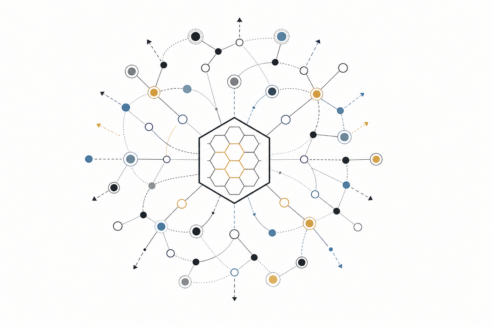
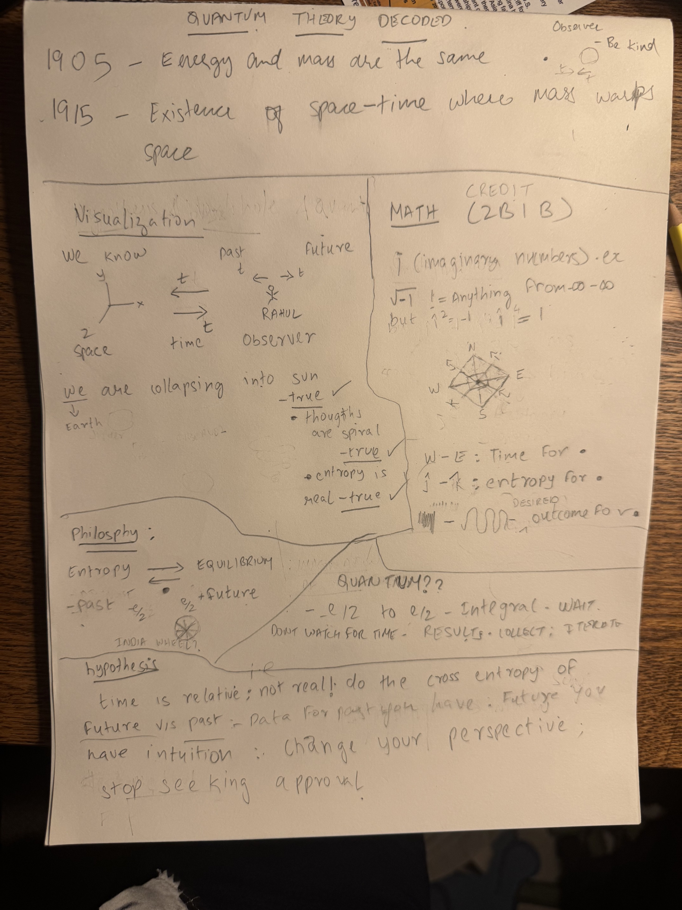

<a class="skip-link" href="#main">Skip to main content</a>

  <header class="site-header">
    <nav class="site-nav" aria-label="Primary">
      rahulrangarao.dev
      <a href="#projects">Projects</a>
      <a href="#writing">Writing</a>
      <a href="#games">Games</a>
      <a class="resume-link" href="https://rahulrangarao.dev/resume.html">Resume</a>
    </nav>
    

      

        <h1>Rahul Rangarao</h1>
        
Systems builder · durable agent memory, provenance-safe compression, agent protocols

        
<strong>Mission:</strong> a knowledge substrate where attribution survives compression, retrieval, and reuse — so plagiarism becomes structurally hard, not just discouraged.

        

          <a href="https://github.com/rahulmranga">GitHub</a>
          <a href="https://medium.com/@rahulmohanrangarao">Medium</a>
          <a href="https://dev.to/rahulmranga">Dev.to</a>
          <a href="https://www.linkedin.com/in/rahul-mohan/">LinkedIn</a>
        

      

      
    

  </header>
  <main id="main">
    <section class="chain-section" aria-labelledby="chain-heading">
      <h2 id="chain-heading">The chain</h2>
      

        <a class="chain-node" href="https://innertrek.me">Mohan Ranga Rao</a>
        →
        Rahul Rangarao
        →
        <a class="chain-node kids" href="#games">Artifacts &amp; games for the kids</a>
      

      
one chain, played three ways · dad writes at <a href="https://innertrek.me">innertrek.me</a>

    </section>
    <section id="projects" class="content-section" aria-labelledby="projects-heading">
      <h2 id="projects-heading">Projects</h2>
      

        <a class="project-card" href="https://github.com/rahulmranga/knowledge-worker">
          kw<strong>knowledge-worker</strong>Local-first knowledge graph for durable, provenance-backed AI-assistant memory.<small>PYPI · ~500 DL/MO · PYTHON</small>
        </a>
        <a class="project-card" href="https://protocol.vaked.dev">
          ag<strong>AG-UI protocol</strong>Open protocol for agent / UI interoperability.<small>PROTOCOL.VAKED.DEV</small>
        </a>
        <a class="project-card" href="https://kompress.vaked.dev">
          kp<strong>kompress</strong>The research case for provenance-preserving compression — paper + notebook.<small>RESEARCH · KOMPRESS.VAKED.DEV</small>
        </a>
        <a class="project-card" href="https://github.com/peterlodri-sec/longrun-eval-kompress">
          ev<strong>longrun-eval-kompress</strong>Eval harness for long-running compression, with Peter Lodri.<small>GITHUB · COLLAB</small>
        </a>
      

    </section>
    <section id="writing" class="content-section" aria-labelledby="writing-heading">
      <h2 id="writing-heading">Writing</h2>
      <article>
        <a class="writing-card" href="https://rahulrangarao.dev/blog/quantum-theory-decoded/">
          
          <strong>Quantum Theory Decoded</strong>A readable decoding of a handwritten note: mass-energy equivalence, spacetime, entropy, observation — and the cross-entropy-of-future as a way to reason under uncertainty.<small>July 4, 2026 · essay + source note</small>
        </a>
        
more at <a href="https://medium.com/@rahulmohanrangarao">medium.com/@rahulmohanrangarao</a> · <a href="https://dev.to/rahulmranga">dev.to/rahulmranga</a>

      </article>
    </section>
    <section id="games" class="content-section" aria-labelledby="games-heading">
      <h2 id="games-heading">Games</h2>
      

        <a class="game-widget day" href="https://rahulmranga.github.io/kompress-ultra/maze.html">🌀cosmic mazeRALPH × LODRIdaylight for dad ☀️</a>
        <a class="game-widget night" href="https://rahulmranga.github.io/kompress-ultra/games.html">🎪cosmic playgroundthe kids' arcadenight sky 🌙</a>
        <a class="game-widget night" href="https://rahulmranga.github.io/kompress-ultra/memory.html">🃏space matchflip cards, find pairstap or click</a>
        <a class="game-widget night" href="https://rahulmranga.github.io/kompress-ultra/stars.html">⭐star catchercatch falling starskeys or touch</a>
      

    </section>
    <section class="content-section" aria-labelledby="showcase-heading">
      <h2 id="showcase-heading">Showcase</h2>
      

        <a href="https://rahulmranga.github.io/kompress-ultra/ohm.html"><strong>ohm</strong>ॐ · 136.1 Hz Earth year tone</a>
        <a href="https://rahulmranga.github.io/kompress-ultra/spacetime.html"><strong>spacetime</strong>Jupiter, light cones, geodesics</a>
        <a href="https://rahulmranga.github.io/kompress-ultra/org.html"><strong>org</strong>one knowledge graph, org lens</a>
        <a href="https://rahulmranga.github.io/kompress-ultra/brain-dist.html"><strong>brain-dist</strong>same graph, brain lens</a>
      

    </section>
  </main>
  <footer class="site-footer">
    © 2026 Rahul Rangarao
    <a href="https://github.com/rahulmranga">github.com/rahulmranga</a>
    <a href="https://rahulrangarao.dev/resume.html">resume</a>
    <a href="https://innertrek.me">innertrek.me (dad)</a>
    <a href="https://rahulrangarao.dev/llms.txt">llms.txt</a>
  </footer>

