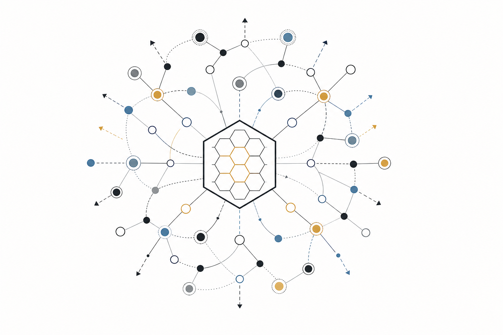
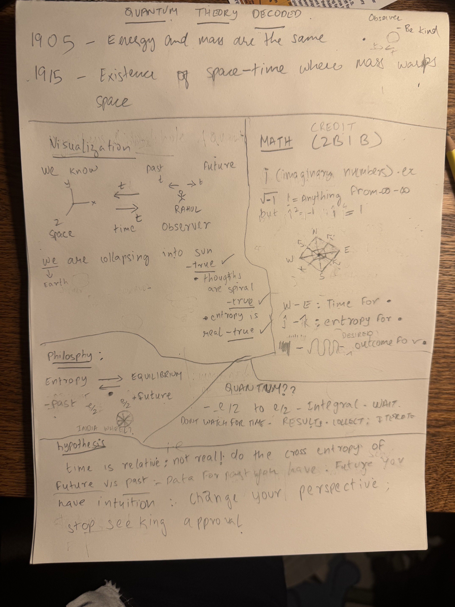

<a class="skip-link" href="#main">Skip to main content</a>
<button class="theme-toggle" id="theme-toggle" type="button" aria-label="Toggle light and dark mode">🌙 Dark mode</button>

  <header class="site-header">
    <nav class="site-nav" aria-label="Primary">
      rahulrangarao.dev
      <a href="#projects">Projects</a>
      <a href="#games">Games</a>
      <a href="#showcase">Showcase</a>
      <a href="#writing">Writing</a>
      <a class="resume-link" href="https://rahulrangarao.dev/resume.html">Resume</a>
    </nav>
    

      

        <h1>Rahul Rangarao</h1>
        
Systems builder · Data/Analytics Engineer · Building durable agent memory, provenance-safe compression 

        
<strong>Mission:</strong> a knowledge substrate where attribution survives compression, retrieval, and reuse — so plagiarism becomes structurally hard, not just discouraged.

        

          
          
          
          
        

      

      
    

  </header>
  <main id="main">
    <section class="chain-section" aria-labelledby="chain-heading">
      <h2 id="chain-heading">The chain</h2>
      

        <a class="chain-node" href="https://innertrek.me">Mohan Ranga Rao</a>
        →
        Rahul Rangarao
        →
        <a class="chain-node kids" href="#games">Artifacts &amp; games for the kids</a>
      

      
one chain, played three ways · dad writes at <a href="https://innertrek.me">innertrek.me</a>

    </section>
    <section id="projects" class="content-section" aria-labelledby="projects-heading">
      <h2 id="projects-heading">Projects</h2>
      

        <a class="project-card" href="https://github.com/rahulmranga/knowledge-worker">
          kw<strong>knowledge-worker</strong>Local-first knowledge graph for durable, provenance-backed AI-assistant memory.<small>PYPI · ~500 DL/MO · PYTHON</small>
        </a>
        <a class="project-card" href="https://github.com/rahulmranga/Dimensional-Accuracy-Assertion">
          da<strong>Dimensional-Accuracy-Assertion</strong>Machine-vision defect detection: laser triangulation on a Raspberry Pi to measure nut and bolt dimensions.<small>GITHUB · PYTHON</small>
        </a>
        <a class="project-card" href="https://github.com/rahulmranga/bitcoin_metcalfe_law">
          bm<strong>bitcoin_metcalfe_law</strong>Replication of a paper testing Metcalfe's Law against Bitcoin network value.<small>GITHUB · JUPYTER NOTEBOOK</small>
        </a>
      

    </section>
    <section id="games" class="content-section" aria-labelledby="games-heading">
      <h2 id="games-heading">Games</h2>
      

        <a class="game-widget day" href="/artifacts/maze.html">🌀cosmic mazeRALPH × LODRIdaylight for dad ☀️</a>
        <a class="game-widget night" href="/artifacts/games.html">🎪cosmic playgroundthe kids' arcadenight sky 🌙</a>
        <a class="game-widget night" href="/artifacts/memory.html">🃏space matchflip cards, find pairstap or click</a>
        <a class="game-widget night" href="/artifacts/stars.html">⭐star catchercatch falling starskeys or touch</a>
      

    </section>
    <section id="showcase" class="content-section" aria-labelledby="showcase-heading">
      <h2 id="showcase-heading">Showcase</h2>
      

        <a href="/artifacts/resume-graph.html"><strong>resume-graph</strong>72 nodes, every one cited</a>
        <a href="/artifacts/ohm.html"><strong>ohm</strong>ॐ · 136.1 Hz Earth year tone</a>
        <a href="/artifacts/spacetime.html"><strong>spacetime</strong>Jupiter, light cones, geodesics</a>
      

    </section>
    <section id="writing" class="content-section" aria-labelledby="writing-heading">
      <h2 id="writing-heading">Writing</h2>
      <article>
        <a class="writing-card no-image" href="https://medium.com/@rahulmohanrangarao/anthropic-named-their-models-after-poetic-forms-i-think-they-accidentally-mapped-the-human-brain-a0c71d94909e">
          <strong>Anthropic named their models after poetic forms. I think they accidentally mapped the human brain?</strong>Haiku, Sonnet, Opus as cognitive modes: matching the model to System 1 pattern-matching or System 2 deliberation, and why picking the wrong mode is where the work goes sideways.<small>May 10, 2026 · Medium</small>
        </a>
        <a class="writing-card no-image" href="https://dev.to/rahulmranga/i-got-tired-of-re-explaining-myself-to-ai-so-i-built-a-memory-graph-3i11">
          <strong>I got tired of re-explaining myself to AI. So I built a memory graph</strong>Why context doesn't persist between sessions, why dumping notes and plain RAG both fall short, and the provenance-backed knowledge graph behind knowledge-worker.<small>May 18, 2026 · Dev.to</small>
        </a>
        <a class="writing-card" href="https://rahulrangarao.dev/blog/quantum-theory-decoded/">
          
          <strong>Quantum Theory Decoded</strong>A readable decoding of a handwritten note: mass-energy equivalence, spacetime, entropy, observation — and the cross-entropy-of-future as a way to reason under uncertainty.<small>July 4, 2026 · essay + source note</small>
        </a>
        
more at <a href="https://medium.com/@rahulmohanrangarao">medium.com/@rahulmohanrangarao</a> · <a href="https://dev.to/rahulmranga">dev.to/rahulmranga</a>

      </article>
    </section>
  </main>
  <footer class="site-footer">
    © 2026 Rahul Rangarao
    <a href="https://github.com/rahulmranga">github.com/rahulmranga</a>
    <a href="https://rahulrangarao.dev/resume.html">resume</a>
    <a href="https://innertrek.me">innertrek.me (dad)</a>
    <a href="/app">graph</a>
    <a href="https://rahulrangarao.dev/llms.txt">llms.txt</a>
  </footer>

<!--
  Structured data. Every @id and url uses the apex host over https, matching
  <link rel="canonical"> — the www host 301s away, and JSON-LD matches @id
  strings exactly, so a www/apex mismatch would break the publisher link.
  Note: jekyll-seo-tag also emits its own WebSite node into <head>.
-->

